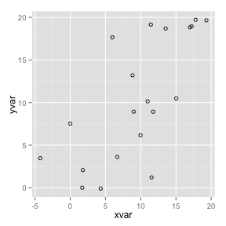
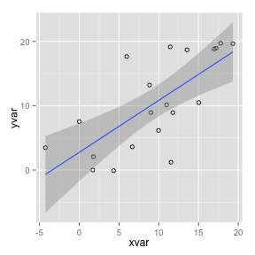
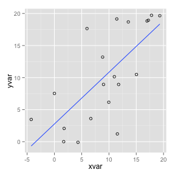
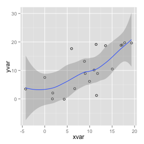

# 8. Graphs
## 8.1 Graphs with ggplot2
### 8.1.1 Scatterplots

```r
<<<<<<< HEAD
# データを作成
set.seed(955)
dat <- data.frame(cond = rep(c("A", "B"), each=10),
                  xvar = 1:20 + rnorm(20,sd=3),
                  yvar = 1:20 + rnorm(20,sd=3))
library(ggplot2)

# 散布図
ggplot(dat, aes(x=xvar, y=yvar)) + 
  geom_point(shape=1)      # Use hollow circles
=======
> # データを作成
> set.seed(955)
> dat <- data.frame(cond = rep(c("A", "B"), each=10),
+                   xvar = 1:20 + rnorm(20,sd=3),
+                   yvar = 1:20 + rnorm(20,sd=3))
> library(ggplot2)
> 
> # 散布図
> ggplot(dat, aes(x=xvar, y=yvar)) + 
+   geom_point(shape=1)      # Use hollow circles
>>>>>>> a1dd9cb68a3dae5ab31f7e98762b4fa8671273ac
```

 

```r
<<<<<<< HEAD

# 散布図に回帰直線を追記
ggplot(dat, aes(x=xvar, y=yvar)) +
  geom_point(shape=1) +    # Use hollow circles
  geom_smooth(method=lm)   # Add linear regression line  (by default includes 95% confidence region)
=======
> 
> # 散布図に回帰直線を追記
> ggplot(dat, aes(x=xvar, y=yvar)) +
+   geom_point(shape=1) +    # Use hollow circles
+   geom_smooth(method=lm)   # Add linear regression line  (by default includes 95% confidence region)
>>>>>>> a1dd9cb68a3dae5ab31f7e98762b4fa8671273ac
```

 

```r
<<<<<<< HEAD

# 信頼区間の表示をオフ
ggplot(dat, aes(x=xvar, y=yvar)) +
  geom_point(shape=1) +    # Use hollow circles
  geom_smooth(method=lm,   # Add linear regression line
              se=FALSE)    # Don't add shaded confidence region
=======
> 
> # 信頼区間の表示をオフ
> ggplot(dat, aes(x=xvar, y=yvar)) +
+   geom_point(shape=1) +    # Use hollow circles
+   geom_smooth(method=lm,   # Add linear regression line
+               se=FALSE)    # Don't add shaded confidence region
>>>>>>> a1dd9cb68a3dae5ab31f7e98762b4fa8671273ac
```

 

```r
<<<<<<< HEAD

# 回帰曲線を追記
ggplot(dat, aes(x=xvar, y=yvar)) +
  geom_point(shape=1) +    # Use hollow circles
  geom_smooth()            # Add a loess smoothed fit curve with confidence region
=======
> 
> # 回帰曲線を追記
> ggplot(dat, aes(x=xvar, y=yvar)) +
+   geom_point(shape=1) +    # Use hollow circles
+   geom_smooth()            # Add a loess smoothed fit curve with confidence region
>>>>>>> a1dd9cb68a3dae5ab31f7e98762b4fa8671273ac
```

```
## geom_smooth: method="auto" and size of largest group is <1000, so using
## loess. Use 'method = x' to change the smoothing method.
```

 

